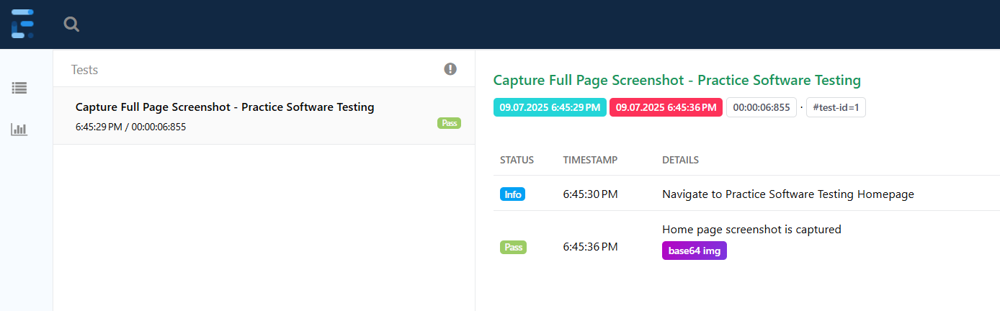

# Selenium Full-Page Screenshot Demo

A small Selenium + TestNG demo showing how to capture **full-page screenshots** using **AShot**, convert them to **Base64 strings**, and embed them into **Extent Reports**. Great for demonstrating automated visual reporting in web tests.

---

## Features

- Capture **vertical full-page screenshots** of web pages using AShot.
- Convert screenshots to **Base64** for embedding directly in HTML reports.
- Log screenshots in **Extent Reports** for easy test reporting.
- Demonstrates **Page Object Model (POM)** and clean Selenium utilities.

---

## Project Structure
```
ashot-extent-integration/
├─ src/
│ ├─ main/
│ │ ├─ java/
│ │ │ ├─ pages/
│ │ │ │ └─ PracticeHomePage.java
│ │ │ ├─ utils/
│ │ │ └─ ScreenshotUtil.java
│ │ │ └─ SeleniumUtils.java
│ ├─ test/
│ └─ java/
│ └─ tests/
│ └─ PracticeHomePageScreenshotTest.java
├─ pom.xml
```
---

## Getting Started

**1.Clone Repository:**
git clone https://github.com/My3Hub/selenium-fullpage-screenshot.git

**2.Install dependencies:**
Make sure you have Maven and Java installed. All dependencies are in pom.xml.

**3.Run the test:**
 Execute the TestNG test `PracticeHomePageScreenshotTest.java`.  

**4.View the report:**  
Open the generated Extent Report at:
target/extent-reports/spark/index.html
You will see the full-page screenshot embedded as a Base64 image.

---
## Screenshot Example

---
## Tools & Libraries
- Java
- Selenium WebDriver
- TestNG
- AShot
- ExtentReports


